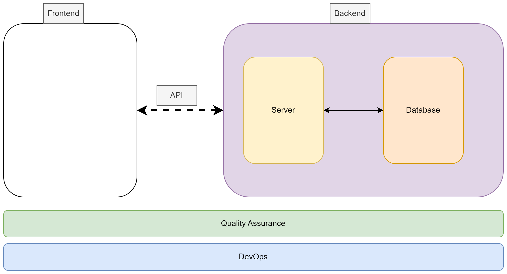

# Sprint 1: Deadline 2025-01-31

- [Deliverables](#deliverables)
- [Assessment Criteria](#assessment-criteria)
- [Considerations](#considerations)
- [Block Diagram Fullstack Application](#block-diagram-fullstack-application)
- [Project Ideas](#project-ideas)

> **When a group is making a sprint presentation, members from two other groups will be required to ask questions to the presenting group.**

----
### Deliverables

1. Prototype
  - [Low-fidelity]
  - Tools: [Figma](https://www.figma.com/) or [Draw.io](https://app.diagrams.net/) 
2. Project description 
  - The title of the project
  - The names of the members
  - The target users and other stakeholders
  - The main functionality of the application. 
  - Describe the user stories and Product backlog: You might consider using [Trello](https://trello.com/)
3. Share your insights on the Sprint ceremonies:
   - Daily Scrum
   - Sprint Review
   - Retrospective
   - More on [Scrum](https://www.scrum.org/learning-series/what-is-scrum/)
4. Make sure to include each member’s contributions to this sprint.
5. Presentation: Here’s a [template for a 12-minute presentation](./ppt-template.md) to help you structure your content effectively.

### Assessment Criteria 

For the first sprint, the assessment criteria are not stringent. Groups can earn the maximum points by **making a 15-minute group presentation** and **submitting the required deliverables** to GitHub.

Bonus points can be earned if:
- The product backlog is generated according to the DEEP principle.
- User stories are based on the INVEST principle.
- The use of [Retrospective templates](https://agilebox.app/blog/4ls-retrospective/)

### Considerations

- When working with Figma, consider saving a local copy of the Figma file.
  - *You can save a local copy of a file in the .fig (Figma Design), .jam (FigJam), or .deck (Figma Slides) formats: `File > Save local copy `*
- Utilize [Trello](https://trello.com/) to organize user stories and manage the product backlog.
- Consider using LLM e.g ChatGPT for:
  - Generating user stories and evaluating them in alignment with the **INVEST** principle
  - Constructing a product backlog and Assessing tasks with respect to the **DEEP** principle

### Block Diagram Fullstack Application

### Project Ideas

> **If you don't have a project yet**, you can consider one of the followings:

1. **Task Management App**: Create a task management application where users can register, log in, and manage their tasks. Users should be able to create, update, and delete tasks, set deadlines, and mark tasks as completed. 

2. **E-commerce Platform**: Build a basic e-commerce platform where users can browse products, add them to the cart, and proceed to checkout. Implement features like product search, category filtering, user authentication, and order history. 

3. **Blogging Platform**: Develop a blogging website where users can create, edit, and delete blog posts. Include user authentication, comment sections, and the ability to categorize posts. 

4. **Social Media Clone**: Create a simplified version of a social media platform like Twitter or Instagram. Allow users to post updates, follow other users, like and comment on posts, and have a profile page. 

5. **Weather Dashboard**: Develop a weather dashboard that displays current weather conditions and forecasts for a given location. Users can enter a city name or use geolocation for weather updates. Utilize a weather API to fetch weather data. Database can be used to store user preferences for saved locations.

6. **Personal Finance Tracker**: Build a personal finance tracker that allows users to log their income and expenses. Provide visualizations of spending patterns and income trends. 

7. **Recipe Sharing App**: Develop a platform for users to share and discover recipes. Allow users to create and edit their own recipes, as well as search and browse recipes by category. 

8. **Portfolio Website**: Create a portfolio website for users to showcase their work and skills. Include sections for projects, about me, contact information, and possibly a blog. 

9. **Fitness Tracking App**: Build a fitness tracking application that allows users to log their workouts, track progress over time, and set fitness goals. Users can input exercises, sets, reps, and weights for each workout session. 

10. **Job Board Platform**: Create a job board where employers can post job listings and job seekers can search and apply for jobs. Implement features such as filtering by location, job type, and skill requirements. Users can have profiles with their resumes and application history. 

11. **Language Learning App**: Develop a platform for learning languages, incorporating vocabulary exercises, quizzes, and flashcards. Users can select the language they want to learn and track their progress. 

<!-- 
user stories referred to as tickets:
https://www.jacobparis.com/content/agile-ticketing 
-->

<!-- Links -->
[Low-fidelity]:https://www.invisionapp.com/inside-design/low-fi-vs-hi-fi-prototyping/ 
